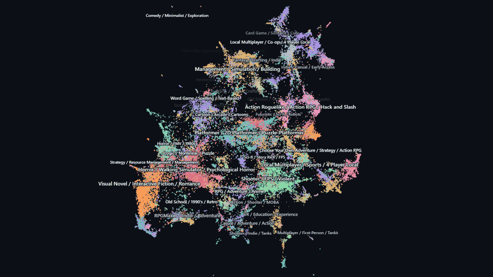

# Pyxis

A zoomable map of the Steam catalog where the zoom levels come from a semantic
cluster hierarchy, not from geometric tiles.

Zoomed out you see broad territories. Zoom in and a territory splits into its
real sub-genres. Zoom again and it splits further. Every label names an actual
group of similar games, and no point ever moves.



## What this is trying to show

[WizMap](https://arxiv.org/abs/2306.09328) (ACL 2023) builds its
multi-resolution labels from a **quadtree over the 2D layout**. Its own
limitations section concedes this is "sensitive to tile size selection" and
that clustering-based alternatives "warrant exploration."

This is that alternative. Labels come from a cluster hierarchy built in
**512 dimensions**; the quadtree only decides which bytes to send the browser.
The two structures are deliberately never merged:

|            | Cluster tree    | Quadtree                 |
| ---------- | --------------- | ------------------------ |
| Built from | 512-d vectors   | 2D coordinates           |
| Answers    | what does this group *mean* | what to send the browser |
| Drives     | labels, colour  | tile loading             |
| Balanced   | no              | yes                      |

Level-of-detail is keyed to a cluster's **screen footprint**, not its depth in
the tree, so a small territory surfaces later and a large one subdivides
sooner with no per-level tuning.

## Numbers

| | |
| --- | --- |
| Catalog | 56,129 games, 98.0% with ≥3 community tags, 451 distinct tags |
| Embedding | hybrid text + tag co-occurrence, 512-d, 56.0% held-out tag prediction @5 |
| Hierarchy | recursive Leiden — 1,117 nodes, 874 leaves, 27 territories, containment **1.000 exact** |
| Layout | containment 0.85–0.95 per depth; purity 0.52 → 0.12; purity lift 8.0 / 48.0 / 72.5 |
| Renderer | 200,000 points at **0.77 ms/frame** (4.6% of a 60 fps budget), one draw call |
| Tiles | 1,000,000 points tiled in **1.07 s**; binary vs JSON **233×** parse in Python, up to **3,160×** in browser |
| Cold load | first frame at **1.83 s** over a throttled 5 Mbps link, 252 KB |

Full methodology, and the results that went the other way, are in
[EXPLAIN.md](EXPLAIN.md).

## Things the numbers do not flatter

Kept here rather than buried, because they are the honest part:

- **Only 10–15% of a game's true nearest neighbours are also its nearest on
  screen.** That is inherent to projecting 512 dimensions onto 2, not a defect
  of this layout. The map is therefore a navigational aid, **not a metric
  space** — hover reads a game's real neighbours from the embedding and shows
  them wherever they land, rather than pretending screen distance means
  similarity.
- **Plotly's scattergl is not slow.** It is also WebGL and re-renders 200k
  points in ~4 ms. The honest claim is 2–5× on re-render and ~100× on first
  paint. What the custom renderer buys is control — per-point shading by active
  ancestor, confidence dimming, neighbour haloing — not raw speed.
- **deepscatter was not benchmarked.** Standing it up means porting onto a
  second tiling scheme, and a number from a half-configured competitor is worse
  than no number.
- **Purity collapses with depth** (0.52 at depth 1 to 0.12 at depth 4). A
  supervised layout scored a perfect 1.000 on that metric and was **rejected
  anyway**, because purity rewards separation and the geometry it destroyed is
  what the recommendation layer depends on.
- **Phases 7–9 are unfinished** — the personal library overlay, the full
  benchmark table, and the consolidated write-up.

## Layout

```
ingest/    data acquisition + resumable crawler
embed/     vectorisation, three variants compared
cluster/   hierarchy extraction + sibling-scoped labelling
layout/    UMAP + hierarchy-consistency measurement
tiles/     quadtree builder, binary format   [STANDALONE, own LICENCE]
viewer/    WebGL front end (regl, no framework, no build step)
```

`tiles/` has no imports from the rest of this repo and no idea what a game is.
Two tests enforce it: one parses every source file for host imports, the other
greps for domain vocabulary. It takes `x, y, id, category, importance` and can
be pointed at any dataset.

## Running it

```bash
python -m venv .venv && .venv/Scripts/pip install -r requirements.txt
```

Each stage has its own README with exact commands:
[ingest](ingest/README.md) · [embed](embed/README.md) ·
[cluster](cluster/README.md) · [layout](layout/README.md) ·
[tiles](tiles/README.md)

```bash
python -m viewer.server 8777      # then open http://localhost:8777
```

Note that the viewer needs generated tiles in `viewer/public/`, which are not
committed — see the stage READMEs to build them.

## Data, attribution and what is not redistributed

**No Steam data is redistributed by this repository.** The catalog, model
weights, vectors, cluster artifacts and generated tiles are all gitignored.
What ships is the code plus instructions to regenerate everything.

- Catalog seeded from the [FronkonGames Steam games dataset](https://huggingface.co/datasets/FronkonGames/steam-games-dataset).
- Tags and review counts enriched via [SteamSpy](https://steamspy.com/). The
  crawler sends an identifying User-Agent, rate-limits by a configurable delay,
  backs off on HTTP 429 and is resumable. Anyone running it is responsible for
  complying with SteamSpy's and Valve's terms.
- Header images are **hotlinked from Steam's CDN at runtime**, never bundled.
- Screenshots in `docs/` contain Steam store art, reproduced for illustration.
  Game names, artwork and trademarks belong to their respective publishers.
  This project is unaffiliated with Valve.

## Licence

MIT — see [LICENSE](LICENSE). `tiles/` carries [its own copy](tiles/LICENSE),
since it is meant to be usable on its own.
