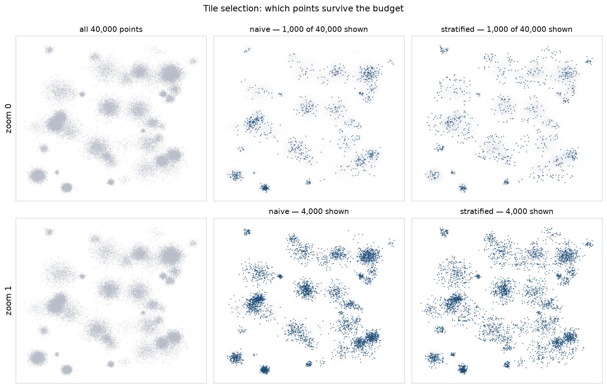

# tiles

A quadtree tile pyramid for scatter data too large to send to a browser at
once. Point coordinates in, a directory of binary tiles out.

**This library is domain-agnostic and ships as its own project.** It has no
idea what its points represent. Its input is `x, y, id, category, importance`;
`category` is an opaque integer and `importance` is an opaque scalar where
larger means more important. There are no imports from any host application,
and two tests enforce that: one parses every source file for imports of host
packages, the other greps for domain vocabulary.

Requires `numpy`. `pyarrow` only for parquet input, `matplotlib` only for
`tiles.render`.

## Quick start

```bash
python -m tiles build points.parquet out/
python -m tiles build points.parquet out/ --strategy naive --max-zoom 6 --gzip
python -m tiles inspect out/
python -m tiles bench --sizes 10000 100000 1000000
python -m tiles.render points.parquet docs/selection.png --zoom 0 1
```

Different column names? Map them:

```bash
python -m tiles build data.parquet out/ --columns '{"importance":"weight","category":"group"}'
```

## Output

```
out/
  tiles.json        bounds, zoom levels, strategy, sizes
  0/0/0.bin         one tile
  1/0/0.bin  1/1/0.bin  ...
```

Tests: `python -m pytest tiles/ -q` — 26 tests.

## What it guarantees

**Every point is reachable.** Leaf tiles apply no importance selection, so at
maximum zoom every input point appears in exactly one tile. A pyramid that
silently drops points is worse than useless: the map looks complete and the
missing item simply cannot be found. `test_every_point_reachable` asserts it
for both strategies.

**Tiles are independently renderable.** A point may appear in a coarse tile
and again in finer ones. That redundancy (about 3× at `max_zoom=5`) means a
viewer can draw any tile without having fetched its ancestors, and panning
never leaves holes.

## Selection strategy: the decision that shapes the map

A tile holds at most N points, and *which* N decides what a zoomed-out view
looks like.



| strategy | zoom 0 | zoom 1 |
| --- | ---: | ---: |
| naive — top N by importance | 45% of the plane occupied | 71% |
| **stratified** — top N per grid cell | **59%** | **92%** |

*(occupancy = fraction of a 32×32 grid over the data extent containing at
least one shown point; 40,000 clustered synthetic points, N=1,000)*

Naive selection concentrates on wherever importance is high and leaves
low-importance regions visibly empty — a viewer reads those regions as sparse
when they are merely unimportant. Stratified selection subdivides each tile
into a grid and takes the best from each cell, so spatial shape survives while
importance still decides which point represents each cell. Stratified is the
default.

## Format: struct-of-arrays, and why

The payload is **struct-of-arrays** — all x, then all y, then all ids, then
categories, then importances — not interleaved records.

Interleaved `x:f32 y:f32 id:u32 cat:u32 imp:u16` is an 18-byte stride, so
consecutive `x` values are 18 bytes apart and `Float32Array` cannot view them:
`Float32Array` needs a contiguous, 4-byte-aligned run. Interleaved data can
only be read through `DataView` field by field, in a JavaScript loop, which is
most of the cost a binary format exists to avoid. With SoA the browser does:

```js
const xs = new Float32Array(buf, offset, count);   // zero copy
```

The interleaved layout is still implemented (`--aos`) so the choice is
measurable rather than asserted.

```
header:  magic(4) "ATLS" | version(2) | flags(2) | count(4) | bbox(16)  = 28 B
body:    x[f32] y[f32] id[u32] category[u32] importance[u16], padded to 4 B
```

`count` is 4 bytes, not 2. Two bytes caps a tile at 65,535 points, which is
fine at the default N=1,000 but makes the format unable to express a coarse
whole-dataset tile — and this library benchmarks to 1,000,000.

## Benchmarks

Clustered synthetic points with a Pareto importance distribution. Uniform
points would flatter the quadtree; uniform importance would flatter naive
selection.

**Build scaling** (`max_zoom=5`, `N=1000`):

| points | seconds | µs/point | tiles | point records | MB |
| ---: | ---: | ---: | ---: | ---: | ---: |
| 10,000 | 0.02 | 1.67 | 781 | 44,735 | 0.8 |
| 100,000 | 0.11 | 1.08 | 913 | 221,580 | 4.0 |
| 1,000,000 | 1.07 | 1.07 | 931 | 1,185,226 | 21.4 |

100× the points costs 64.5× the time — sub-linear, because tile count
saturates once every quadrant is occupied and the per-point work is a bucket
assignment.

**Format** (mean over 50 tiles of the 100k set):

| | raw | gzipped | parse |
| --- | ---: | ---: | ---: |
| binary | 15,450 B | 10,555 B | **0.003 ms** |
| JSON | 86,052 B | 22,669 B | 0.748 ms |
| ratio | 5.6× | 2.1× | **233×** |

The size argument for binary is real but weaker than usually claimed — gzip
narrows 5.6× down to 2.1×. **The parse argument is the decisive one**, and it
is the one size tables omit: 233× slower, and gzip does nothing for it. On a
tile budget of ~200 cached tiles that is the difference between a frame and a
stall.

**Viewport → tile list:**

| zoom | mean tiles | µs/query |
| ---: | ---: | ---: |
| 0 | 1.0 | 3.34 |
| 3 | 7.4 | 3.90 |
| 5 | 8.4 | 4.04 |

Constant-time in practice: the query is arithmetic on the bounds, not a tree
walk.

## The category manifest

Point records carry a **leaf category id only**. The renderer walks upward
through `parent` pointers in the manifest. For 1M points and a depth-5
hierarchy, storing full ancestor chains per point would cost ~16 MB of
duplicated data that is identical for every point in a category.

Each manifest entry carries:

| field | for |
| --- | --- |
| `id`, `parent` | walking the hierarchy |
| `label` | display text |
| `bbox`, `centroid` | level-of-detail by screen footprint |
| `size` | label priority / collision ordering |
| `confidence` | how *strongly* to draw a label, not just whether |
| `purity` | whether to draw the category as a region at all |
| `depth` | convenience |

`confidence` and `purity` are opaque to this library — it guarantees they
survive the round trip and validates structure (dangling parents, cycles,
malformed bboxes), nothing more. They exist because a renderer needs to dim an
uncertain label rather than drop it, and to decline drawing a region for a
category whose points are scattered.

## Limits

- **Redundancy is ~3× at `max_zoom=5`.** Storage is linear in zoom depth; the
  default trades disk for independently renderable tiles.
- **No tile merging for sparse regions.** An empty quadrant produces no file,
  but a quadrant with three points still produces one.
- **`importance` is rank-normalised into uint16 on load.** Ordering is
  preserved exactly; absolute magnitudes are not. Selection only uses order.
- **Single-threaded.** 1M points in ~1 s, so parallelism has not been needed.
